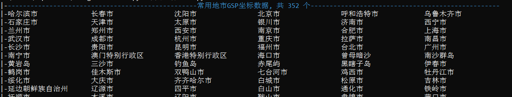

# GpsAndMap

## 介绍

整合了GPS坐标和坐标系数据的GPS坐标类，提供了不同坐标系之间的转换方法，提供了不同GPS坐点球面距离的计算方法。
二次封装了 folium 库，提供了常用 Map 及相关 folium对象及 plugins对象的方法/属性接口，提供了便利的图层管理接口。

## 模块结构
- GpsModule.py 
  - 【GPS坐标系类型】枚举定义
  - 【GPS坐标系类】定义 
  - 【常用坐标】对象
- MapModule.py
  - 【颜色名】枚举定义
  - 【热力点类】定义
  - 【图标样式类】定义
  - 【提示样式类】定义
  - 【消息样式类】定义
  - 【封闭图形样式类】定义
  - 【线条样式类】定义
  - 【线上文本样式类】定义
  - 【网页标题样式类】定义
  - 【图标标记类】定义
  - 【圆圈标记类】定义
  - 【正多边形标记类】定义
  - 【蚂蚁路径标记类】定义
  - 【矩形标记类】定义
  - 【多边形标记类】定义
  - 【折线类】定义
  - 【参考线类】定义
  - 【热力层类】定义
  - 【图层类】定义
  - 【地图类】定义


## 依赖说明
本模块依赖以下库:
- DebugInfo
- folium
- 其它标准库


## 安装教程
```bash
pip install GpsAndMap
```

## 使用说明
### GpsAndMap.GpsModule 模块
👉**GPS坐标系类型**定义了常用的坐标系: gcj02, wgs84, bd09

👉**GPS坐标类**定义了一个类,该类封装了GPS坐标的经纬度值,以及坐标系信息,以及不同坐标系的转换方法
```python
from GpsAndMap.GpsModule import *

# 下面实例化了一个GPS坐标类, 该坐标经纬度值以 gcj02坐标系下取得
上海坐标: GPS坐标类 = GPS坐标类(121.5681254, 31.98545896, GPS坐标系类型.gcj02)  # 此处经纬度值为杜撰值,非真实值

# 下面取得并使用gcj02坐标系下的坐标值
print(上海坐标.gcj02坐标)

# 下面取得并使用wgs84坐标系下的坐标值, 类内部会自动进行坐标系转换
print(上海坐标.wgs84坐标)

# 下面取得并使用bd09坐标系下的坐标值, 类内部会自动进行坐标系转换
print(上海坐标.bd09坐标)

# 下面传入坐标系参数,取得对应坐标系下的坐标值
目标坐标系: GPS坐标系类型 = GPS坐标系类型.wgs84
print(上海坐标.目标坐标(目标坐标系=目标坐标系))
```

👉**常用坐标**对象集成了350+个常用地市的GPS坐标信息(gcj09坐标系),为日常使用提供了便利
```python
from GpsAndMap.GpsModule import *

# 打印上海市坐标
print(常用坐标.上海市)

# 打印西安市在wgs84下的坐标
print(常用坐标.西安市.wgs84坐标)

# 打印常州市在bd09下的坐标
print(常用坐标.常州市.bd09坐标)

# 打印指定坐标系下的合肥市坐标
目标坐标系: GPS坐标系类型 = GPS坐标系类型.gcj02
print(常用坐标.合肥市.目标坐标(目标坐标系=目标坐标系))
```
👉以下代码打印了常用坐标对象内的地市列表, 方便查看
```python
from DebugInfo.DebugInfo import *
from GpsAndMap.GpsModule import *

画板 = 打印模板()

画板.添加多行(list(常用坐标.常用坐标字典.keys()), 拆分列数=8).展示表格()
```
打印截图一角如下:


#### 参与贡献

1. Fork 本仓库
2. 新建 Feat_xxx 分支
3. 提交代码
4. 新建 Pull Request

#### 特技

1. 使用 Readme\_XXX.md 来支持不同的语言，例如 Readme\_en.md, Readme\_zh.md
2. Gitee 官方博客 [blog.gitee.com](https://blog.gitee.com)
3. 你可以 [https://gitee.com/explore](https://gitee.com/explore) 这个地址来了解 Gitee 上的优秀开源项目
4. [GVP](https://gitee.com/gvp) 全称是 Gitee 最有价值开源项目，是综合评定出的优秀开源项目
5. Gitee 官方提供的使用手册 [https://gitee.com/help](https://gitee.com/help)
6. Gitee 封面人物是一档用来展示 Gitee 会员风采的栏目 [https://gitee.com/gitee-stars/](https://gitee.com/gitee-stars/)
